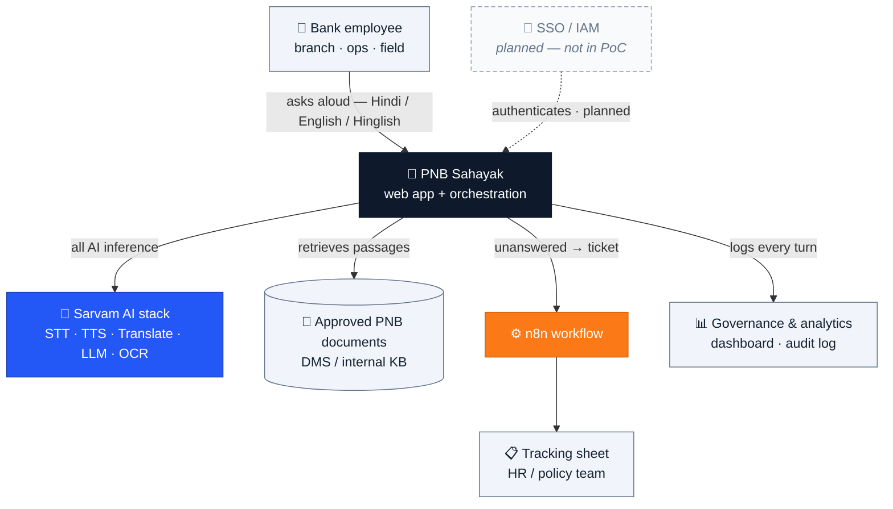
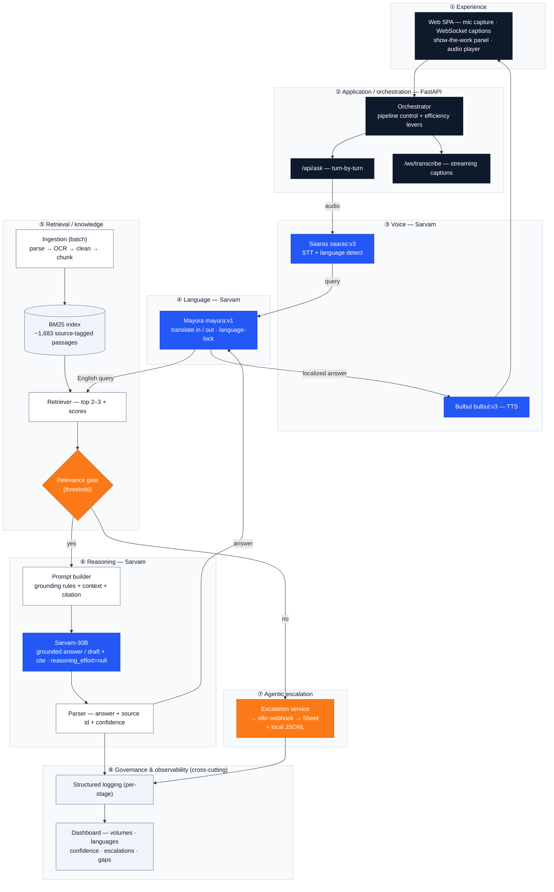
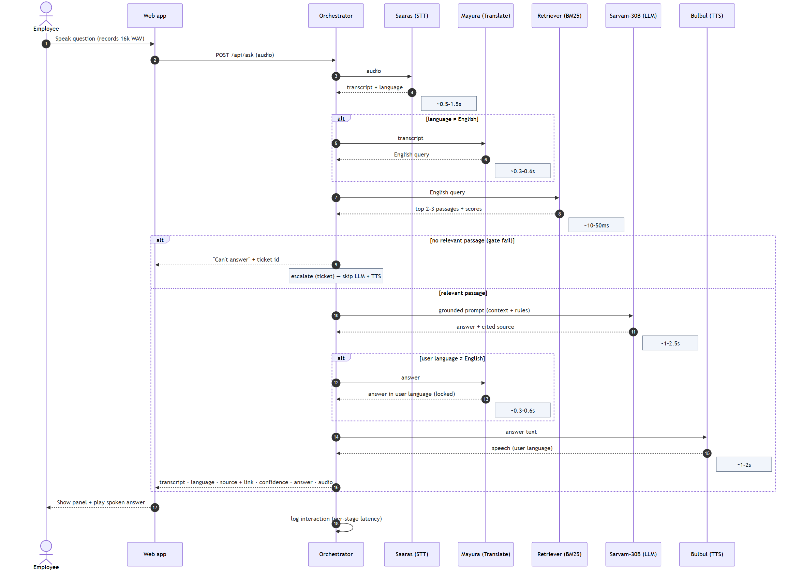
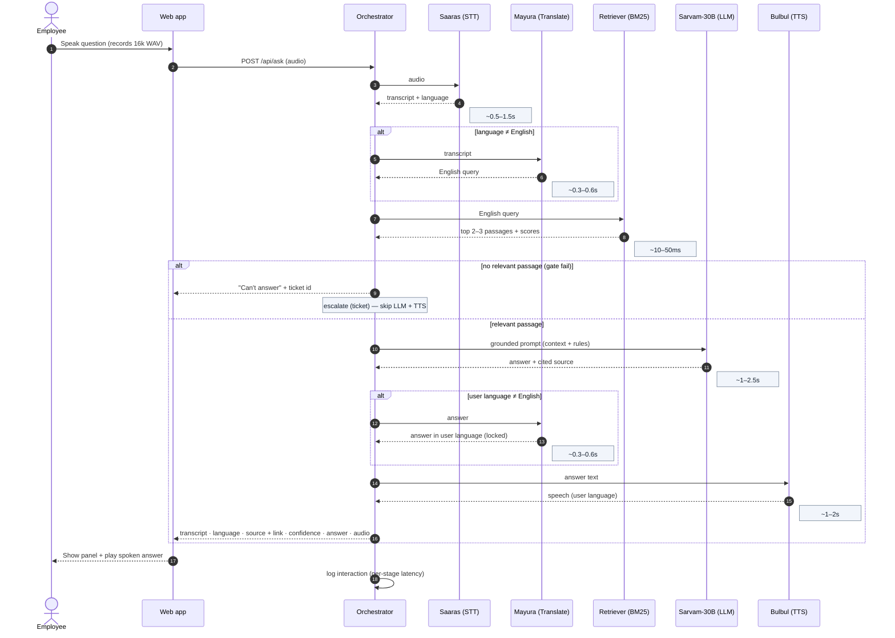
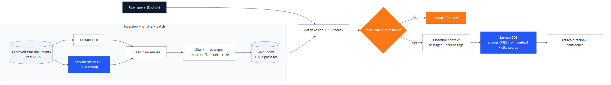
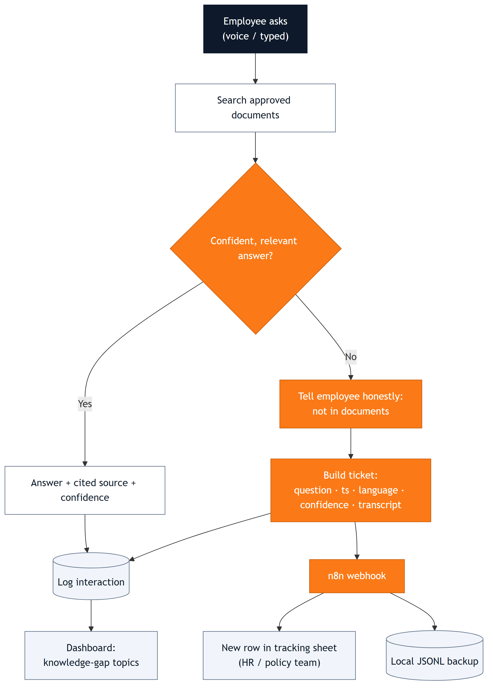
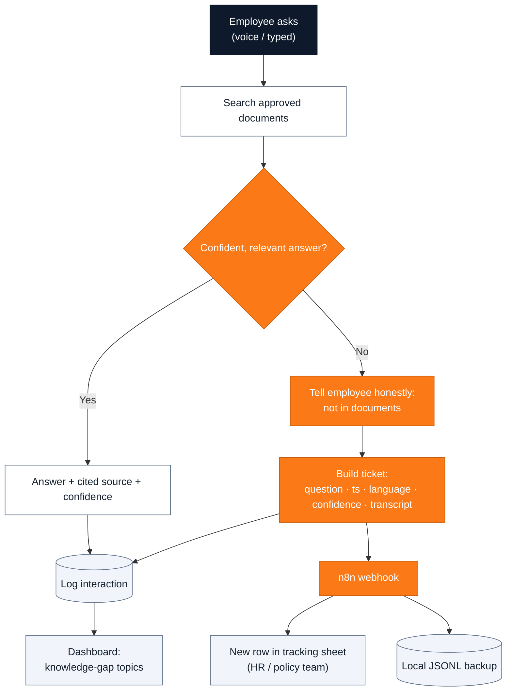
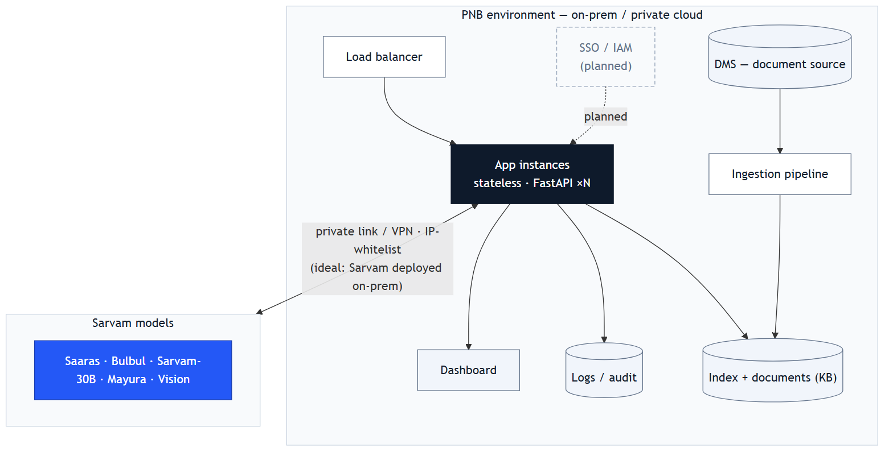
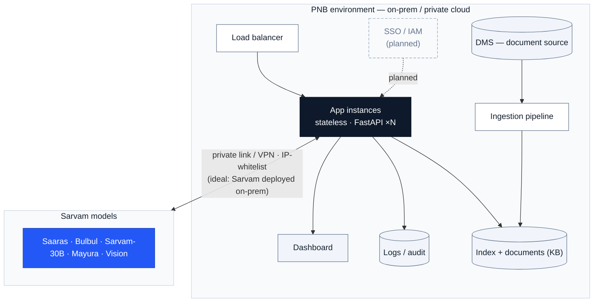

# Architecture — PNB Sahayak

**A multilingual, voice-first employee policy assistant on the Sarvam AI stack.**
This document is the Solution Architecture: six architecture views (context → components →
sequence → RAG → agentic escalation → deployment), plus security, non-functionals, and the
Sarvam API rationale. Each view is shown as a diagram image, with the editable Mermaid source
collapsed beneath it.

> **Diagram legend (palette).**
> 🟦 **Blue** = Sarvam models · ⬛ **Navy** = our app / orchestration ·
> 🟧 **Orange** = decision gates & the escalation path · ⬜ **Light** = supporting components & data stores.
>
> The diagrams below are also in [`docs/diagrams/`](diagrams/) as high-resolution PNGs (handy for slides).

---

## 1 · System context — who and what it talks to

Diagram source (Mermaid)

**In words.** Employees interact by voice; the app uses the Sarvam stack for all AI; it
answers **only from approved PNB documents**; unanswered questions become tracked tickets;
every turn is logged for governance. **SSO/IAM authentication is planned for production — the
PoC itself has no sign-in.** *(The PoC uses Sarvam's hosted API + a Google Sheet + a local
knowledge base; production adds SSO/IAM and uses Sarvam on-prem + the bank's DMS.)*

---

## 2 · Logical / component architecture — the layers

Diagram source (Mermaid)

**Component notes.** The **orchestrator** applies the efficiency levers (skip translate when
the language is English; skip the LLM entirely on a gate-fail; cap answer length; reasoning
off). **Ingestion** is an offline/batch pipeline, re-run only when documents change. The
**relevance gate** is the safety heart: no sourced passage → no generation → escalate.
**Production upgrade:** swap/augment BM25 with **hybrid retrieval** (BM25 + dense embeddings +
a cross-encoder reranker) on a vector store for higher precision.

---

## 3 · End-to-end request sequence — data flow + latency budget

Diagram source (Mermaid)

**Latency budget:** target **~4–6s** end-to-end for a turn (text visible in ~2–3s; audio
follows — TTS is usually the largest single cost). The **streaming captions** path
(`/ws/transcribe`) is separate and real-time (words appear as you speak).

---

## 4 · RAG / knowledge pipeline — ingestion → grounded answer

```mermaid
flowchart LR
    subgraph INGEST["Ingestion — offline / batch"]
        direction LR
        DOCS[("Approved PNB documents<br/>56 real PDFs")]:::store
        EXT["Extract text"]:::neutral
        OCR["Sarvam Vision OCR<br/>(2 scanned)"]:::sarvam
        CLEAN["Clean / normalize"]:::neutral
        CHUNK["Chunk → passages<br/>+ source: file · URL · title"]:::neutral
        IDX[("BM25 index<br/>~1,683 passages")]:::store
        DOCS --> EXT --> CLEAN
        DOCS --> OCR --> CLEAN
        CLEAN --> CHUNK --> IDX
    end
    Q["User query (English)"]:::app
    RET["Retrieve top 2–3 + scores"]:::neutral
    GATE{"max score ≥ threshold?"}:::decision
    ESC["Escalate (no LLM)"]:::escalate
    CTX["Assemble context<br/>passages + source tags"]:::neutral
    ANS["Sarvam-30B<br/>answer ONLY from context + cite source"]:::sarvam
    CITE["Attach citation + confidence"]:::neutral

    IDX --> RET
    Q --> RET --> GATE
    GATE -->|no| ESC
    GATE -->|yes| CTX --> ANS --> CITE

    classDef app fill:#0E1A2B,stroke:#0E1A2B,color:#ffffff;
    classDef sarvam fill:#2458F6,stroke:#1B3FB0,color:#ffffff;
    classDef decision fill:#FB7A17,stroke:#C85F0E,color:#ffffff;
    classDef escalate fill:#FB7A17,stroke:#C85F0E,color:#ffffff;
    classDef neutral fill:#FFFFFF,stroke:#64748B,color:#15202E;
    classDef store fill:#F1F5FB,stroke:#64748B,color:#15202E;
    style INGEST fill:#F8FAFC,stroke:#CBD5E1,color:#15202E
```

Diagram source (Mermaid)

**Why this is bank-safe:** generation is **retrieval-gated** and **citation-enforced** — the
model is instructed to answer *only* from the injected passages and to name the source; if
nothing clears the threshold, it never reaches the model. This is the concrete control behind
"no hallucination."

---

## 5 · Agentic escalation workflow — event → action, no human in the loop

Diagram source (Mermaid)

**Callouts:** *"Answers only from approved documents."* · *"Unanswered → tracked ticket
automatically."* · *"Every question logged → governance + knowledge-gap insight."*
**Production:** route tickets to the bank's ITSM/workflow instead of a Sheet.

---

## 6 · Deployment & infrastructure — sovereignty / on-prem

Diagram source (Mermaid)

**Residency.** In the ideal RFP-compliant setup, **Sarvam models run inside the bank's
boundary** (sovereign / on-prem) so no document data leaves. If hosted, access is via private
link/VPN with IP-whitelisting and data minimisation. The PoC uses Sarvam's hosted API;
production uses the on-prem / sovereign option.

---

## 7 · Security & governance

| Concern | How it's addressed |
|---|---|
| **AuthN / Z** | *Planned for production (not in the PoC):* SSO/IAM integration; role-based access; per-user audit identity |
| **Data minimisation & residency** | only necessary text sent to models; no training on bank data; on-prem residency (§6) |
| **Grounding guardrails** | retrieval-gated generation + enforced citations + "I don't know → escalate" (§4/§5) |
| **Hallucination monitoring** | confidence score per answer; dashboard tracks confidence distribution and escalation rate; human review of escalations |
| **Audit & explainability** | every answer logged with its source + confidence; append-only interaction log |
| **Compliance mapping** | DPDP (consent, minimisation, access control); RBI FREE-AI (fairness, accountability, transparency, explainability); on-prem residency |

## 8 · Non-functional requirements (NFRs)

| NFR | Approach |
|---|---|
| **Latency** | budget in §3; levers — skip-LLM-on-no-match, skip-translate-on-match, top-2–3 retrieval, capped answers, reasoning off, response cache for common questions |
| **Scalability** | stateless app instances behind a load balancer; served in-memory index; cache layer; concurrency sized to demand |
| **Availability & resilience** | health checks; graceful degradation — local ticket backup if n8n is down; type-fallback if the mic fails |

---

## Sarvam APIs used (and why)

| Sarvam API / model | One line | Why we use it |
|---|---|---|
| **Saaras** (`saaras:v3`) | Speech → text (22 Indian languages) | Understands the spoken question; also powers live streaming |
| **Mayura** (`mayura:v1`, Translate API) | Text → text across languages, code-mixed / Roman styles | Bridges the user's language and the English documents, and keeps Hinglish answers consistent (`sarvam-translate:v1` covers extra languages) |
| **Sarvam-30B** (Chat Completions) | The LLM that reads context and writes the answer or draft | Short, grounded answers and drafted content; chosen over `sarvam-105b` because 30B is recommended for voice / low-latency |
| **Bulbul** (`bulbul:v3`) | Text → speech (11 Indian languages) | Speaks the answer back in the user's language |
| **Sarvam Vision** (Document Digitization) | Document / PDF → text (OCR) | Read the 2 scanned PDFs that had no text layer |

## Built (PoC) vs. Production

| Area | Built now (PoC) | Production upgrade |
|---|---|---|
| **Retrieval** | BM25 over ~1,683 passages | Hybrid: BM25 + dense embeddings + cross-encoder reranker on a vector store |
| **Knowledge source** | 56 real PNB PDFs (local) | Bank **DMS** feed + scheduled re-ingestion |
| **Escalation sink** | n8n → Google Sheet + local JSONL | n8n → bank **ITSM / workflow** |
| **Model hosting** | Sarvam hosted API | Sarvam **on-prem / sovereign** deployment |
| **Access** | open local / shared link | **SSO / IAM**, role-based access |

> All policy documents are **real, public PNB files**; nothing about the bank is fabricated.
