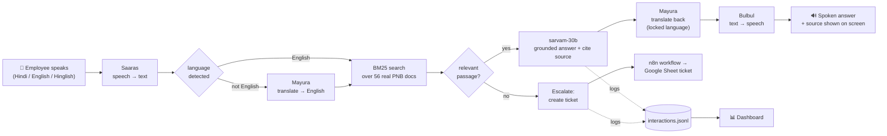

# Architecture — PNB Sahayak

## The turn-by-turn voice pipeline (the core)

**In words:** the employee speaks → **Saaras** transcribes and detects the language →
if it isn't English, **Mayura** translates the question to English → a **BM25 keyword
search** finds the best passage among the 56 real PNB documents → if nothing relevant is
found, the question is **escalated** (a ticket is created and sent to **n8n**); otherwise
**sarvam-30b** writes a short answer grounded *only* in those passages and names the
document it used → **Mayura** translates the answer back into the user's language (one
locked language/style) → **Bulbul** speaks it. Every interaction is logged, feeding the
**dashboard**.

## The supporting pieces

| Piece | What it does | Where |
|-------|--------------|-------|
| **Knowledge base** | 56 real PNB PDFs → text (44 direct, 2 via OCR) → BM25 search | `src/ingest/`, `src/knowledge_base.py` |
| **Answer brain** | language lock, relevance gate, grounding, citations | `src/assistant.py` |
| **Sarvam client** | thin wrappers: listen / translate / think / speak | `src/sarvam_client.py` |
| **Web app** | mic page + "show the work" panel; serves everything | `src/app.py`, `src/web/index.html` |
| **Escalation** | unanswered → ticket → local log + n8n webhook | `src/escalation.py` |
| **Dashboard** | questions / languages / confidence / escalations | `/dashboard`, `src/web/dashboard.html` |
| **Live streaming** | real-time captions (separate, isolated) | `/stream`, `src/web/stream.html` |
| **Post-call analytics** | offline: diarised transcript + LLM summary | `src/call_analytics.py` |

## The Sarvam APIs used (and why)

| Sarvam API / model | One line | Why we use it |
|--------------------|----------|---------------|
| **Saaras** (`saaras:v3`) | Speech → text (22 Indian languages) | Understands the spoken question; also powers live streaming + call diarisation |
| **Mayura** (`mayura:v1`, via the **Translate** API) | Text → text across languages, with code-mixed/Roman styles | Bridges the user's language and the English documents, and keeps Hinglish answers consistent (`sarvam-translate:v1` covers extra languages) |
| **sarvam-30b** (Chat Completions) | The LLM that reads context and writes the answer | Writes short, grounded answers; chosen over `sarvam-105b` because Sarvam recommends the 30B for voice/low-latency |
| **Bulbul** (`bulbul:v3`) | Text → speech (11 Indian languages) | Speaks the answer back in the user's language |
| **Sarvam Vision** (Document Digitization) | Document/PDF → text (OCR) | Read the 2 scanned PDFs that had no text layer |
| **Saaras Batch + diarization** | Recording → who-said-what transcript | Powers the offline post-call analytics |

> All policy documents are **real, public PNB files**; nothing about the bank is fabricated.
